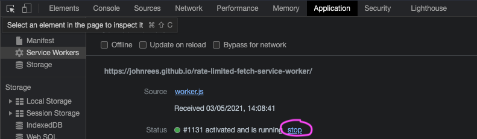

# Rate Limited Fetch Service Worker

This intercepts requests (currently to devnet.solana.com) and tries to enforce a 100ms delay between them, so that they do not get rate limited.

You can toggle whether or not it's running in the Application tab of the browser.

## How it works

First half of video, click to load 100 RPC requests synchronously and a bunch fail due to CORS. Second half, the serviceworker is enabled, it intercepts the requests and adds a varying delay which limits them to approx 10 per second, resulting in no failures.

https://user-images.githubusercontent.com/601961/116901957-74a14380-ac32-11eb-8d75-c7f728d3f5e1.mp4

